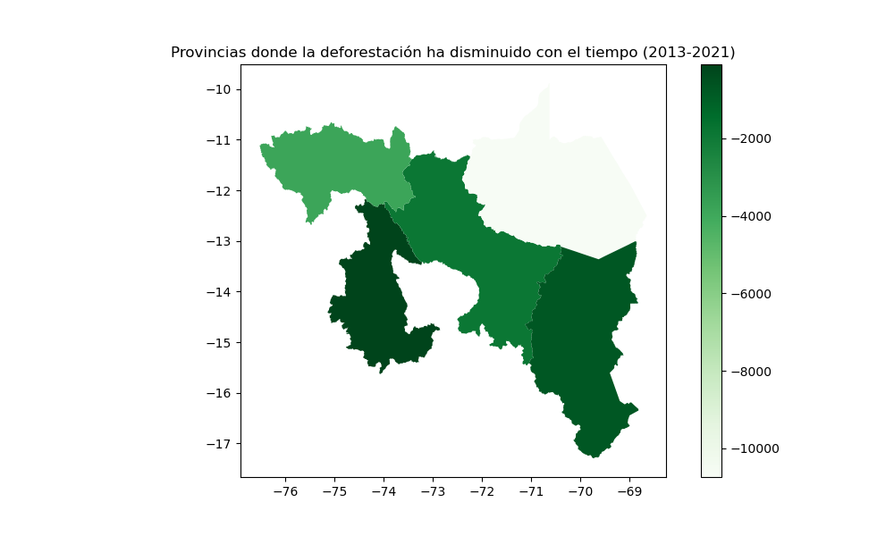
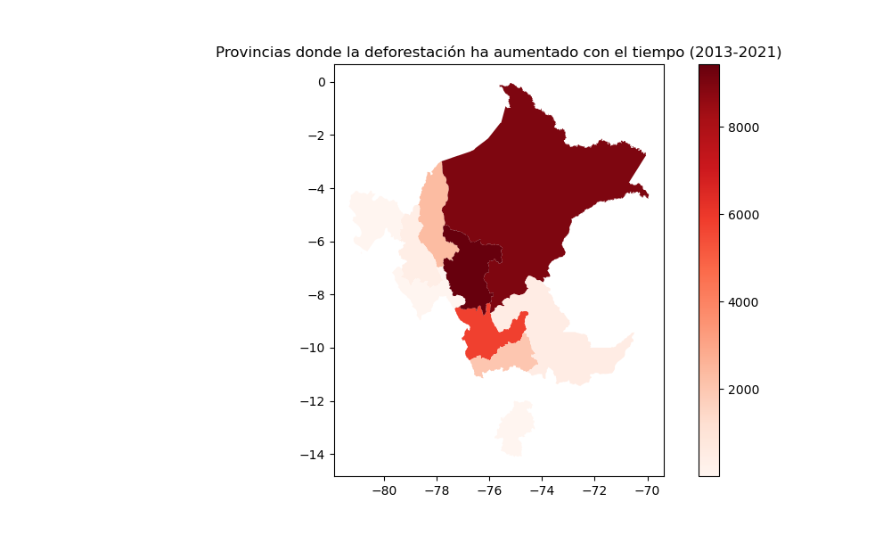

# Análisis de Deforestación en las Provincias de Perú

## Contenido del Repositorio

- `data/`: Carpeta que contiene los archivos de datos utilizados en este análisis, incluyendo shapefiles de las provincias de Perú y datos de deforestación.
- `index.ipynb`: Notebook con el código utilizado para el análisis, visualización y procesamiento de los datos.
- `provincias_mejoraron.png`: Mapa que muestra las provincias que mejoraron en deforestación.
- `provincias_empeoraron.png`: Mapa que muestra las provincias que empeoraron en deforestación.

Link: https://hakufer.github.io/week2_spatialB/

## Diccionario de Datos

### Shapefile de Provincias de Perú
| Variable | Descripción |
| --- | --- |
| **GID_1** | Identificador único de la provincia. |
| **NAME_1** | Nombre de la provincia. |
| **TYPE_1** | Tipo de división administrativa. |
| **geometry** | Geometría de la provincia (polígono). |

### Datos de Deforestación
| Variable | Descripción |
| --- | --- |
| **Departamento** | Nombre del departamento. |
| **2013 - 2021** | Número de hectáreas deforestadas por año. |

